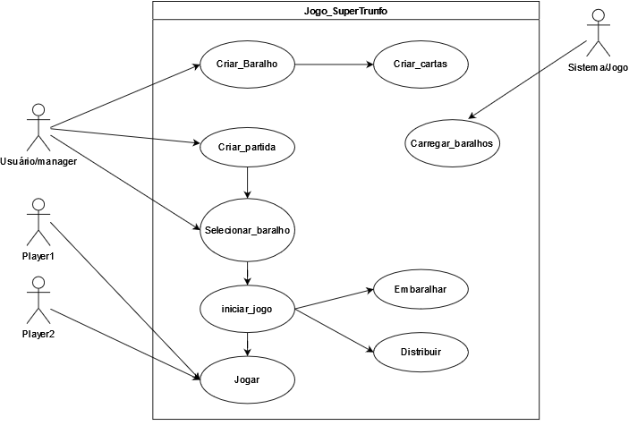
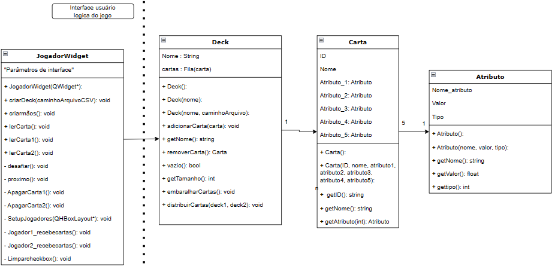
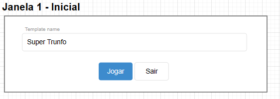
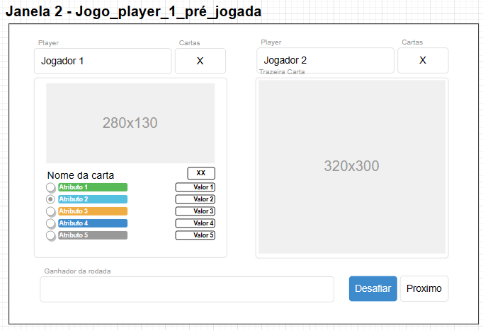
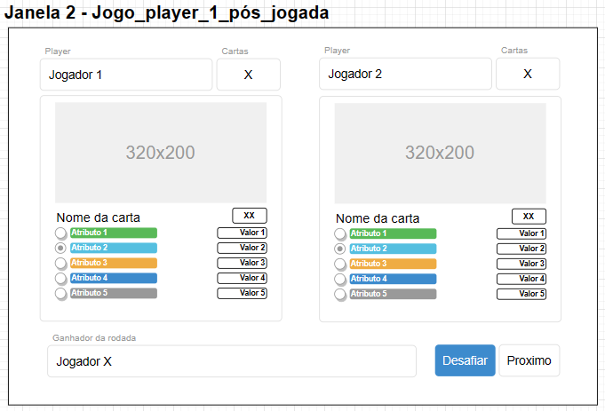
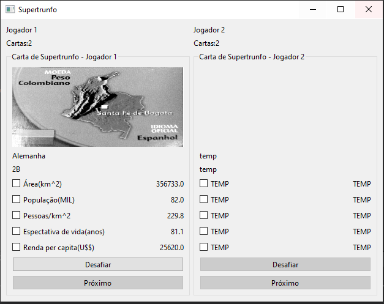
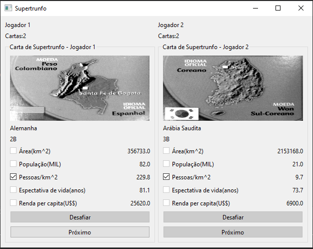

<table align="center"><tr><td align="center" width="9999"> 

# Projeto Final - SuperTrunfo

<b>Instituto Federal de Educação, Ciência e Tecnologia de Santa Catarina 
Campus Florianópolis 
Departamento Acadêmico de Eletrônica 
Programação orientada a Objeto</b>

*Alexsander Vieira*
</td></tr></table>

O jogo SuperTrunfo consiste em jogo de baralho com 32 cartas, cada carta possui 5 atributos que dependendo do baralho utilizado podem ser comparados como maior ou menor. Todas as cartas são divididas em 4 grupos A, B, C e D. Ao iniciar uma partida todas as 32 cartas são embaralhadas e distribuídas igualmente entre os jogadores, depois um jogador inicia selecionando um atributo e desafiando os demais jogadores, se o atributo de sua carta for maior (ou menor dependendo do baralho utilizado) ele ganha as cartas de todos jogadores. A única exceção a esta regra é a carta 1B chamada de Super trunfo, esta carta ganha automaticamente de todas as cartas que não forem do grupo A. Ganha o jogo o jogador que possuir todas as 32 cartas.

Neste projeto o objetivo é implementar uma versão do jogo de SuperTrunfo em C++ com interface gráfica para dois jogadores.

********************************************************
<h2 align="center">Casos de uso</h2>

Para realização deste projeto foram desenhados inicialmente os casos de uso a seguir:

* Um jogador ou sistema de possuir a capacidade de criar um baralho com 32 cartas seguindo o padrão de supertrunfo;
* Um jogador ou sistema de possuir a capacidade de embaralhar e distribuir as cartas entre os jogadores;
* Um sistema de possuir a implementação da lógica de jogo;
* Os jogadores devem possuir a capacidade de selecionar os atributos das cartas para desafiar os demais jogadores;

    
     
    Casos de uso

A imagem acima representa a ideia inicial do escopo dos casos de uso do projeto.

********************************************************
<h2 align="center">Diagrama de classes</h2>

O diagrama de classes abaixo representa a estrutura que implementa o controle de interface e lógica do jogo(jogadorwidget) e as classes necessárias para representar um baralho de Supertrunfo:

    
     
    Diagrama de Classes

********************************************************
<h2 align="center">Rascunho de interface Grafica</h2>

As imagens a seguir representam a ideia inicial de interface gráfica a ser implementada para o jogo:

    
     
    Janela inicial do jogo

    
     
    Janela do primeiro turno - jogador 1 sempre começa

    
     
    Janela pós desafio - mostras cartas de anbos jogadores

********************************************************
<h2 align="center">Interface grafica final</h2>

As imagens a seguir são um exemplo do resultado final da interface do jogo:

    
     
    Janela do primeiro turno - jogador 1 sempre começa

    
     
    Janela pós desafio - mostras cartas de anbos jogadores

